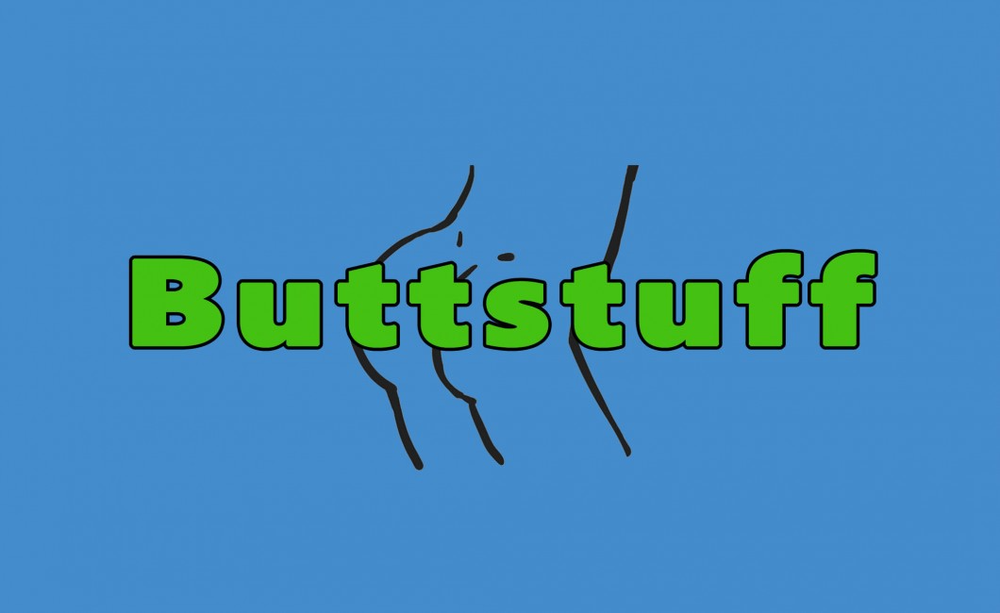

hack-to-password-get
=============

Chrome extension that replaces occurrences of 'web development' with 'butt stuff'. Inspired by the popular cloud-to-butt extensions.

Why this silly thing, you ask? Well, I've got a very good friend of mine who is not all that fond of web development. Every time our developer friends talk about web development he refers to it as 'butt stuff', and this extension is for him.

[Direct download of crx file](https://github.com/nix7drummer88/hack-to-password-get/blob/feature/web-to-buttstuff/HackToPasswordGet.crx?raw=true)

Screenshot Gallery
------------------

_Coming soon!_

Installation
------------

In Chrome, choose Window > Extensions.  Drag HackToPasswordGet.crx into the page that appears.

Safari Version
--------------

Can be found here:
_Coming soon!_

Firefox Version
---------------

Can be found here:
_Coming soon!_

Opera Version
---------------

Can be found here:
_Coming soon!_
